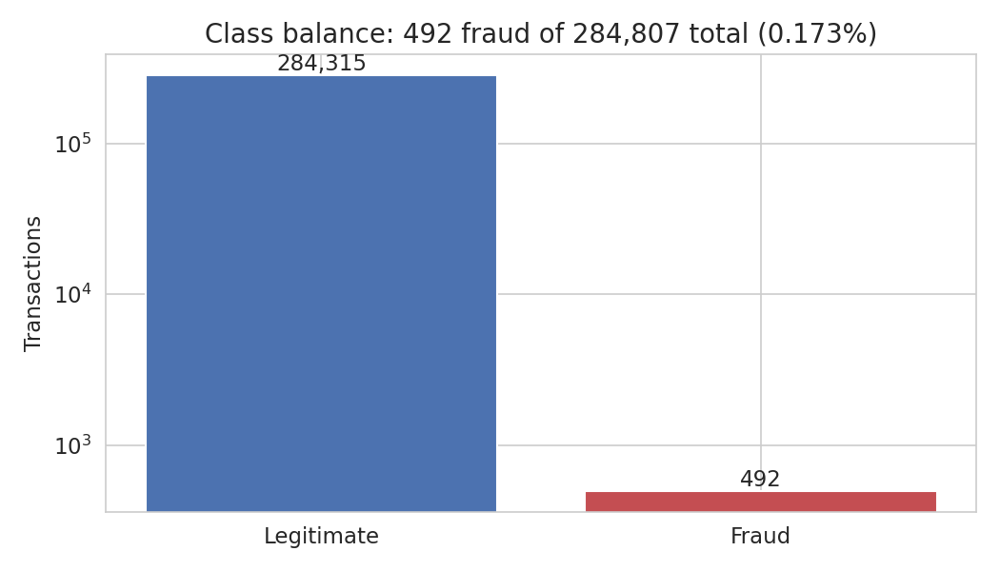
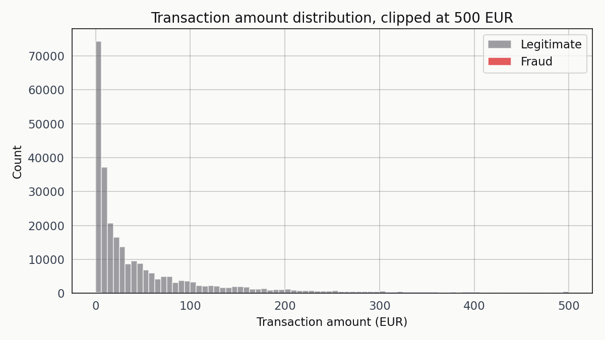
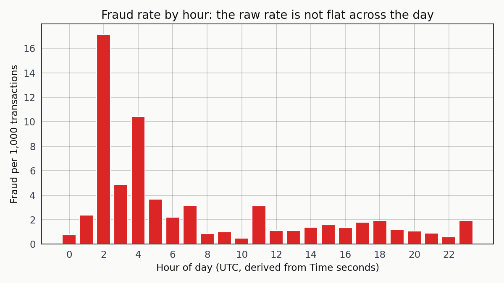
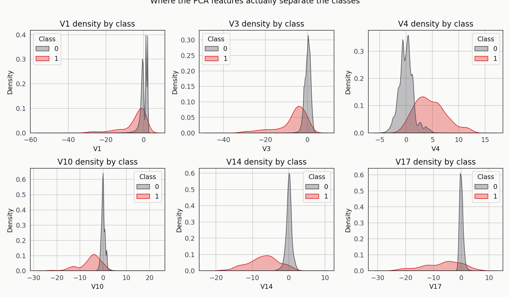
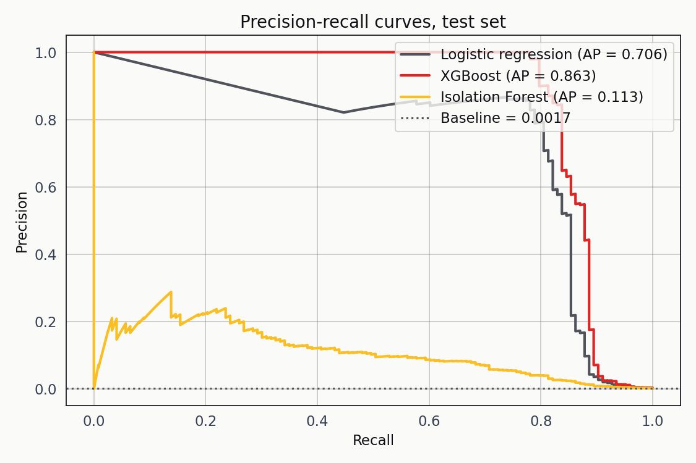
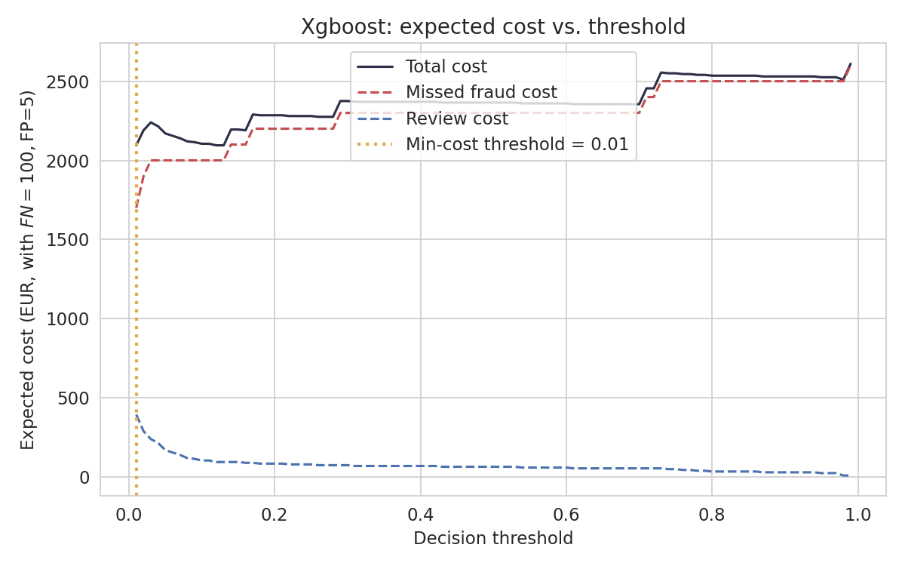
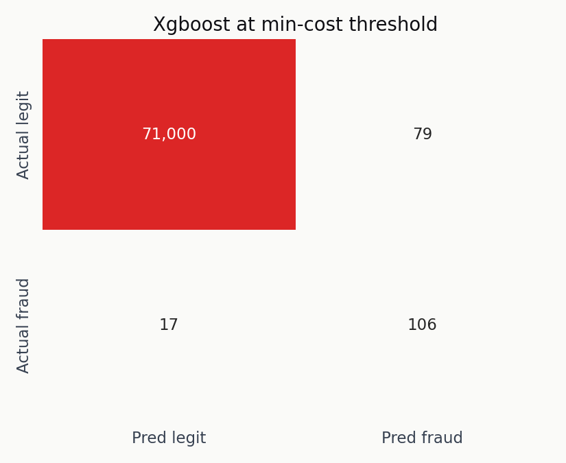
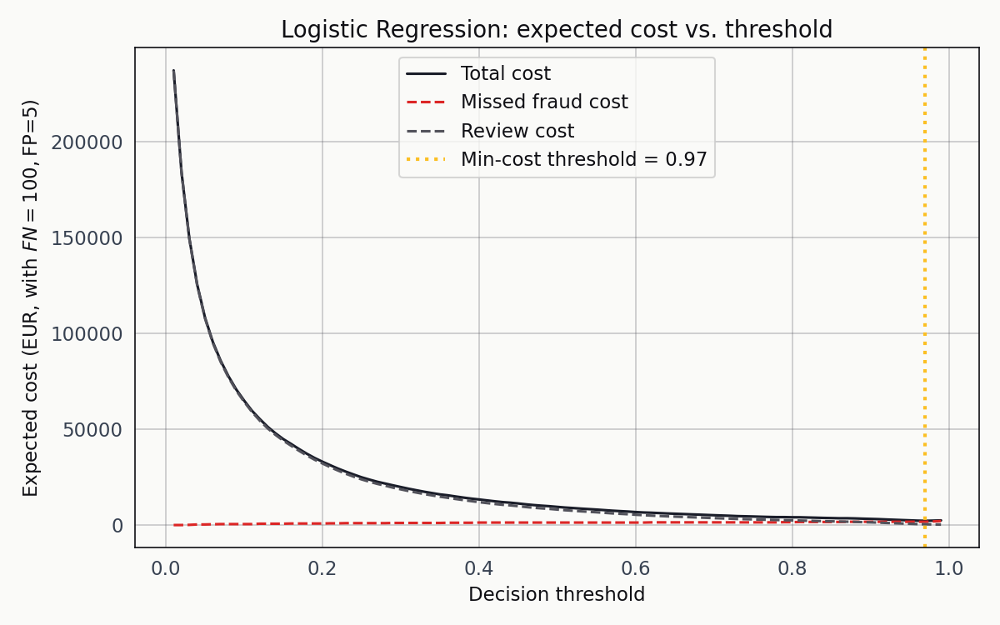
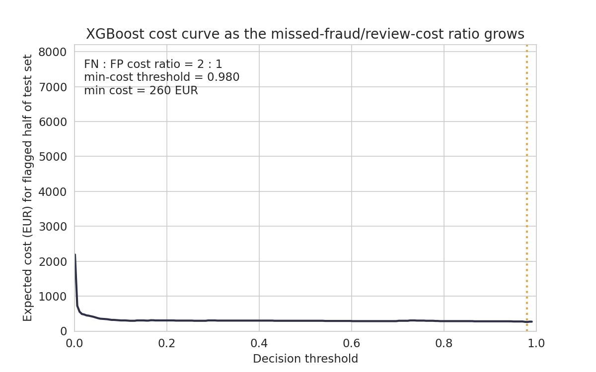

# The Default Threshold Is the Bug: Credit Card Fraud on the ULB Benchmark

I fit an XGBoost classifier on the ULB credit card fraud dataset and it reached 0.9788 ROC-AUC. That's a flattering number. It's also not the thing I actually care about. The question I care about is whether the deployed threshold catches fraud at a cost the business can pay, and on this dataset the 0.5 default is a business decision almost nobody would sign off on if they saw the confusion matrix underneath. This write-up walks through the data, the three models I fit, and the cost-sensitive threshold sweep that reframes the whole evaluation.

## The dataset

The source is a September 2013 sample of card transactions from a European cardholder population, released by the Machine Learning Group at ULB (Dal Pozzolo et al., 2015). 284,807 rows. 492 labelled fraud. That's a 0.1727 percent positive rate — roughly one fraudulent transaction for every 580 legitimate ones.

Every feature except `Time` and `Amount` has been PCA-transformed, so I don't have direct access to merchant ID, card country, or anything else with semantic meaning. The 28 principal components collectively preserve whatever signal the original variables carried while satisfying the cardholder-privacy constraint that kept the raw data from being released in the first place. That's a real limitation and it rules out any analysis that would try to explain the classifier in terms of business-meaningful features.

Two columns sit outside the PCA transform. `Time` is the seconds elapsed from the first transaction in the two-day observation window. `Amount` is the transaction amount in EUR. I standardised both before fitting any model; the principal-component columns are already approximately standardised by construction.

The class balance plot is my starting point for any imbalanced-classification problem. A trivial classifier that predicts "legitimate" for every row is right 99.83 percent of the time and catches zero fraud. That's the floor the rest of the evaluation has to clear.

Fraud clusters at the low end of the amount distribution, which tracks with a card-testing pattern — an attacker validates a stolen card with a small purchase before committing to something larger. A handful of fraudulent transactions sit above 500 EUR but most live in the 0 to 150 range.

The fraud rate isn't flat across the 48 hours of the observation window. There are visible spikes in the late-night hours, which fits the intuition that fraudulent activity runs while legitimate cardholders are asleep. That hourly signal would be more useful with day-of-week information, but the anonymisation step stripped it.

## The PCA separation

One sanity check before training: do the PCA components carry class-separable signal at all?

V14 and V17 are where the fraud cases pile up at values two to three standard deviations away from the legitimate cluster. The rest show a shift without clean separation. That's enough for a supervised classifier to work with, and I'd rather confirm it before training than discover a pathological dataset after wasting an afternoon on modelling.

## Three models

I fit three classifiers with the same stratified 75/25 train-test split. The test set has 123 positives, which is enough to distinguish models and barely enough to sustain the cost sweep that follows.

Logistic regression with `class_weight='balanced'`. This is the honest baseline. It gets the problem shape right, weighs the minority class correctly, and produces calibrated probability scores that a threshold sweep can act on sensibly.

XGBoost with `scale_pos_weight` set to the empirical negative-to-positive ratio. 400 trees at depth 5 with the histogram tree method. The `eval_metric` is `aucpr` rather than `auc` because the precision-recall curve is the right signal at this prevalence.

Isolation Forest trained only on the legitimate class. Unsupervised baseline — it doesn't see the labels during training and treats fraud detection as an anomaly-detection problem. I included it to test whether the PCA-transformed features carry enough geometric signal to separate fraud from legitimate transactions without using the labels at all.

Precision-recall is the right diagnostic here. Baseline precision is 0.0017. Logistic regression reaches AP 0.7062. XGBoost reaches 0.863. The Isolation Forest reaches 0.1133. The unsupervised model isn't a serious contender at this prevalence, and that's a finding in itself: even on geometrically well-behaved PCA-transformed features, anomaly detection without labels loses two orders of magnitude of precision to a supervised baseline.

## The threshold is a policy decision

The reflex is to report accuracy at 0.5 and move on. That reflex is wrong here. The right question is what threshold minimises the total business cost, and to answer that I had to pick a cost model. The one I used treats a missed fraud as a 100-EUR loss (the amortised downstream cost per fraudulent transaction once disputes, chargebacks, and reissuance are included) and a false positive as a 5-EUR manual review. Swapping either number for any real institution is a five-minute edit; the framework doesn't change.

I swept the threshold from 0.001 to 0.99 for each classifier and computed total cost at every step.

The XGBoost cost curve bottoms out at threshold 0.01. That's a startling number the first time you see it. A classifier that flags a transaction the moment it assigns a one-in-a-hundred probability isn't what most tutorials build toward. But it's exactly right for this problem. At prevalence 0.17 percent, a posterior probability of 0.01 is a fifty-seven-fold lift over the base rate, and the review cost stays shallow enough that the optimum sits further left than the usual intuition suggests.

The minimum-cost operating point for XGBoost catches 106 of 123 fraud cases in the test set, misses 17, and flags 79 legitimate transactions for review. Total cost: 2,095 EUR against a no-model baseline of 12,300 EUR.

Logistic regression lands in a similar place with a very different threshold. Its cost curve bottoms out at 0.97, catching 105 fraud cases at a total cost of 2,310 EUR. The two threshold numbers — 0.01 and 0.97 — aren't comparable. XGBoost and logistic regression produce scores with different calibrations; only the resulting cost and recall are comparable across models.

Isolation Forest at its own minimum-cost threshold catches 72 of 123 fraud but flags 710 legitimate transactions for review. Total cost: 8,650 EUR. At the prices I assumed, it does worse than either supervised baseline by a factor of four. Unsupervised anomaly detection isn't viable on this dataset when manual review has non-trivial cost.

## Cost ratio sweep

The ranking of the three models isn't robust to the cost ratio. I re-ran the XGBoost sweep across FN:FP ratios from 2:1 up to 60:1.

As the ratio grows, the minimum-cost threshold walks leftward. At 2:1 it sits around 0.5. By 20:1 it's near 0.05. By 60:1 it's below 0.01. No single threshold is correct; the threshold is a function of the cost structure, not a property of the model. This is the single figure that best captures the argument of the whole project.

Honestly, if I had to pick one chart to show a fraud analytics team, this is the one. The static cost curves above make the point; the animation makes it feel.

## Limitations

The anonymisation is the single largest limitation of the dataset. Every feature except `Time` and `Amount` is a principal component, which prevents any meaningful feature-importance analysis or any domain-driven feature engineering. The two-day observation window is short enough that seasonal effects are invisible. The geography is constrained to European cardholders from a specific 2013 sample, which makes generalisation to the 2026 fraud landscape an act of extrapolation.

The cost model is illustrative rather than calibrated to a specific institution. I picked 100 EUR and 5 EUR because they capture the order-of-magnitude asymmetry most fraud teams work under; the exact numbers should be replaced with the team's own before any production decision is made.

The class imbalance is severe enough that the test set carries only 123 positives, which means the recall estimates have confidence intervals of several percentage points. A ten-fold cross-validated version of this analysis would produce a more stable estimate of the optimal threshold, and that's the natural next step for anyone taking this to production.

## References

Dal Pozzolo, A., Caelen, O., Johnson, R. A., & Bontempi, G. (2015). Calibrating probability with undersampling for unbalanced classification. In *2015 IEEE Symposium Series on Computational Intelligence* (pp. 159-166). IEEE.

Chen, T., & Guestrin, C. (2016). XGBoost: A scalable tree boosting system. In *Proceedings of the 22nd ACM SIGKDD International Conference on Knowledge Discovery and Data Mining* (pp. 785-794).

Liu, F. T., Ting, K. M., & Zhou, Z.-H. (2008). Isolation forest. In *2008 Eighth IEEE International Conference on Data Mining* (pp. 413-422). IEEE.

Elkan, C. (2001). The foundations of cost-sensitive learning. In *Proceedings of the Seventeenth International Joint Conference on Artificial Intelligence* (pp. 973-978).

Machine Learning Group ULB. (2013). *Credit card fraud detection* [Data set]. Kaggle. https://www.kaggle.com/datasets/mlg-ulb/creditcardfraud
